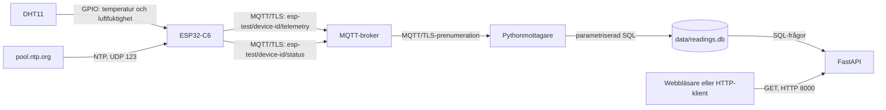

# Arkitektur

## Syfte och dataflöde

Lösningen samlar in temperatur och luftfuktighet från en fysisk DHT11-sensor
ansluten till en ESP32-C6. Mätningarna skickas till en MQTT-broker över TLS,
valideras av en Pythonmottagare, sparas i SQLite och läses via ett lokalt
HTTP-API.



| Del | Ansvar |
| --- | --- |
| DHT11 och `dht_11` | Läser fysisk temperatur och relativ luftfuktighet. Datapinnen anges i firmwarekonfigurationen. |
| `wifi` | Ansluter ESP32 till WiFi, rapporterar om IP-anslutningen finns och schemalägger återförsök i en separat task. |
| `time_sync` | Väntar högst 15 sekunder på NTP-tid från `pool.ntp.org` innan TLS startas. |
| `telemetry_service` | Läser sensorn periodiskt, tidsstämplar mätningar, lägger dem i en FreeRTOS-kö och bygger JSON. |
| `mqtt_service` | Äger TLS/MQTT, enhets-ID, topics, statusmeddelanden och återanslutning. |
| MQTT-broker | Förmedlar publikationer till prenumeranter och hanterar retained status samt Last Will. Körs utanför detta repos Compose-fil. |
| `mqtt_receiver.py` | Prenumererar på MQTT, avkodar och validerar JSON samt sparar godkända mätningar. |
| SQLite | Lagrar mätningar i `data/readings.db`. |
| `api.py` | Gör lagrade mätningar och ett enkelt antal tillgängliga via HTTP. |

`main.c` startar firmware i ordningen WiFi → NTP → MQTT-tjänst →
telemetritjänst. Om WiFi eller tidssynkronisering misslyckas startas inte
MQTT. Telemetritjänsten startas när MQTT-klienten har startats; den behöver
inte vänta på att en brokeranslutning redan är upprättad. Då kan den fortsätta
samla mätningar vid tillfälligt brokeravbrott.

## Nätverk och adressering

| Kommunikation | Adress och port | Protokoll |
| --- | --- | --- |
| ESP32 → broker | `CONFIG_APP_MQTT_BROKER_URI` i lokal `sdkconfig`, format `mqtts://<broker-värdnamn>:<tls-port>` | Vanlig MQTT över TCP/TLS, inte WebSockets |
| Pythonmottagare → broker | `MQTT_BROKER` och `MQTT_PORT` i lokal `.env`; exempelvärdet är `broker.example.invalid:8883` | Vanlig MQTT över TCP/TLS |
| ESP32 → tidstjänst | `pool.ntp.org:123` | NTP över UDP |
| HTTP-klient → lokalt API | `127.0.0.1:8000` vid Pythonstart enligt README | HTTP GET |
| HTTP-klient → Compose-API | Värddatorns port `8000`, publicerad som `8000:8000` | HTTP GET |

`broker.example.invalid:8883` är en platshållare från `.env.example`, inte
den broker som används i projektet. Den aktuella externa MQTT-tjänsten
använder TLS-port **10000**. Det verkliga värdnamnet måste vara nåbart från
både ESP32 och mottagaren och stämma med broker-certifikatet. Värdnamnet
ligger i lokala, Git-ignorerade konfigurationsfiler och skrivs därför inte ut
här. Inför inlämning behöver den använda adresseringen redovisas på ett
sätt som uppfyller kravspecifikationen utan att publicera personlig lokal
konfiguration.

Brokerkonton och topicbehörigheter förvaltas utanför detta repo. Firmwaren
publicerar endast under `esp-test/<device-id>/`. Mottagaren prenumererar i
dag på både `esp-test/#` och ett äldre `building/room-a/climate/#`; det
senare används inte av firmwarens nuvarande topics.

### MQTT-topics och leverans

`<device-id>` är stabilt och skapas från ESP32-enhetens WiFi-MAC-adress med
formatet `esp32-<tolv hextecken>`. Samma värde används som MQTT client ID och
som `sensorId` i JSON.

| Topic | Innehåll | QoS | Retain |
| --- | --- | --- | --- |
| `esp-test/<device-id>/telemetry` | JSON med mätvärden | 1 | Nej |
| `esp-test/<device-id>/status` | `online` efter anslutning | 1 | Ja |
| `esp-test/<device-id>/status` | Brokerpublicerat Last Will `offline` vid oväntad förlust | 1 | Ja |

Keepalive är 60 sekunder. Efter en första lyckad IP-anslutning fortsätter
WiFi-tasken att schemalägga återförsök vid frånkoppling, med en bastid som
fördubblas från 1 till högst 30 sekunder och 0–1000 ms jitter. Bastiden
återställs när enheten får IP igen. Före första lyckade anslutningen gäller
fortfarande `CONFIG_APP_WIFI_MAXIMUM_RETRY` (standardvärde 5). Denna
WiFi-ändring finns i koden men har ännu inte verifierats genom ett nytt
bygg- och långt avbrottstest; se F-02 i testprotokollet.

ESP32 väntar på WiFi/IP innan nya MQTT-försök. MQTT-tjänsten använder en
separat exponential backoff från ungefär 10 till högst 300 sekunder, med
0–1000 ms jitter. Efter minst 60 sekunders stabil anslutning återställs
MQTT-backoffräknaren. Mätningar ligger under avbrott i en RAM-kö med
standardlängd 60. När kön är full kastas äldsta mätningen; ett tappat värde
räknas och loggas. En mätning behålls av publiceringstasken tills MQTT-bibliotekets
outbox har accepterat den. Ett accepterat enqueue är ännu ingen garanti för
att brokern eller mottagaren har lagrat mätningen.

ESP32 publicerar telemetri med QoS 1, medan Pythonmottagarens
`subscribe("esp-test/#")` använder Pahos standardvärde QoS 0. QoS 1 på
publiceringssidan kan fortfarande medföra flera kopior av samma mätning;
orsaken till de observerade dubbletterna är inte fastställd. Firmware loggar
MQTT:s `message_id` vid köläggning och publiceringskvittens, men det ID:t
följer inte oförändrat genom brokern till Pythonklienten.

Pythonmottagaren anropar Pahos `connect()` och därefter `loop_forever()`.
Den loggar anslutning och frånkoppling, men har ingen egen explicit
backoff eller felhantering runt det första `connect()`-anropet. Compose är
konfigurerad med `restart: unless-stopped` för mottagarcontainern.

## Datakontrakt

En MQTT-telemetripayload är JSON med två mätvärden i samma objekt:

```json
{
  "sensorId": "esp32-aabbccddeeff",
  "timestamp": "2026-10-03T12:34:56Z",
  "humidity_value": 45.0,
  "humidity_unit": "%",
  "temperature_value": 21.5,
  "temperature_unit": "C"
}
```

| Fält | Betydelse och mottagarens kontroll |
| --- | --- |
| `sensorId` | Icke-tom sträng. Firmware använder sitt MAC-baserade ID. |
| `timestamp` | Sträng som Python kan tolka som ISO 8601 och som har tidszon. Firmware skriver UTC med `Z`. |
| `humidity_value` | JSON-tal som avkodas till Python `float`, inom 20–90 inklusive gränserna. |
| `humidity_unit` | Strängen `%`. |
| `temperature_value` | JSON-tal som avkodas till Python `float`, inom 0–50 inklusive gränserna. |
| `temperature_unit` | Strängen `C`. |

Detta sexfältsformat är projektets utökning av kravspecifikationens
fyrfältsexempel. Firmwaren skriver mätvärden med en decimal. Pythonmottagaren
lagrar godkända värden i sex motsvarande SQLite-kolumner tillsammans med ett
autogenererat `id`. API:t returnerar `sensorId` med samma namn som i
MQTT-payloaden.

## Varför MQTT och hur systemet övervakas

MQTT:s publicera/prenumerera-modell skiljer sensorenheten från lagring och
API. ESP32 behöver känna till brokern, men inte var mottagaren eller
databasen kör. QoS 1 och återanslutning passar periodiska mätningar på ett
nät som kan avbrytas. TLS ger en skyddad transport till brokern. Kostnaden är
ytterligare en tjänst, brokerbehörigheter och möjlighet till dubbletter vid
QoS 1.

Mottagaren loggar anslutning, frånkoppling, mottaget topic, valideringsfel och
godkända mätningar. Firmware loggar bland annat sensorfel, köstatus,
MQTT-publicering och återanslutning. `GET /api/v1/status` ger antalet lagrade
rader och Compose har en API-healthcheck mot `/health`. `/health` kontrollerar
bara att API-processen svarar; den provar inte SQLite, brokern eller sensorn.

## Begränsningar och förbättringar

- Samma mätning har observerats flera gånger i mottagare och databas
  (O-01 i testprotokollet). QoS 1-omsändning är en hypotes, inte en
  fastställd orsak. Databas och API har ingen deduplicering.
- RAM-kön är inte beständig över omstart och kan tappa äldsta mätningar vid
  längre avbrott. Persistens eller en tydlig larmgräns vore nästa steg.
- Mottagarens breda `esp-test/#`-prenumeration omfattar statusmeddelandena
  `online`/`offline`, som nu behandlas som ogiltig JSON och ger missvisande
  valideringsvarningar. Prenumeration eller topic-routing bör snävas in.
- En larmkölängd finns i konfigurationen men ingen larmkö används ännu.
- `storedReadings` visar historisk radmängd, inte aktuell sensorkontakt.
  Tid sedan senaste mätning och en felräknare skulle ge bättre övervakning.
- Pythonmottagaren bör få tydlig felhantering och väntan även när den första
  brokeranslutningen misslyckas.
- Det sammanhängande flödet från fysisk DHT11 till API verifierades
  2026-10-05 (M-03), men dubblettavvikelsen O-01 kvarstår.
