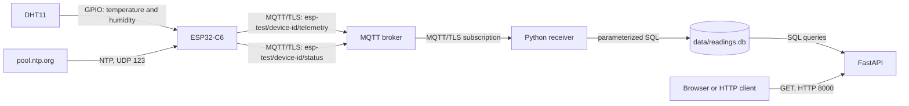

# Architecture

## Purpose and data flow

The solution collects temperature and humidity from a physical DHT11 sensor
connected to an ESP32-C6. Readings are sent to an MQTT broker over TLS,
validated by a Python receiver, stored in SQLite, and read through a local
HTTP API.



| Component | Responsibility |
| --- | --- |
| DHT11 and `dht_11` | Read physical temperature and relative humidity. The data pin is set in the firmware configuration. |
| `wifi` | Connects the ESP32 to WiFi, reports IP connectivity, and schedules retries in a separate task. |
| `time_sync` | Waits up to 15 seconds for NTP time from `pool.ntp.org` before TLS starts. |
| `telemetry_service` | Reads the sensor periodically, timestamps readings, queues them in FreeRTOS, and builds JSON. |
| `mqtt_service` | Owns TLS/MQTT, the device ID, topics, status messages, and reconnection. |
| MQTT broker | Forwards publications to subscribers and handles retained status and Last Will. It is outside this repository's Compose setup. |
| `mqtt_receiver.py` | Subscribes to `esp-test/+/telemetry` with QoS 1, decodes and validates JSON, and stores new valid readings. |
| SQLite | Stores readings in `data/readings.db`. |
| `api.py` | Exposes stored readings and a simple count over HTTP. |

`main.c` starts the firmware in this order: WiFi → NTP → MQTT service →
telemetry service. MQTT does not start if WiFi or time synchronization fails.
The telemetry service starts once the MQTT client has started; it does not
wait for an established broker connection. It can therefore continue
collecting readings during a temporary broker outage.

## Network and addressing

| Communication | Address and port | Protocol |
| --- | --- | --- |
| ESP32 → broker | `CONFIG_APP_MQTT_BROKER_URI` in local `sdkconfig`, formatted as `mqtts://<broker-hostname>:<tls-port>` | Ordinary MQTT over TCP/TLS, not WebSockets |
| Python receiver → broker | `MQTT_BROKER` and `MQTT_PORT` in local `.env`; `broker.example.invalid:8883` is a placeholder | Ordinary MQTT over TCP/TLS |
| ESP32 → time service | `pool.ntp.org:123` | NTP over UDP |
| HTTP client → local API | `127.0.0.1:8000` when Python is started as described in the README | HTTP GET |
| HTTP client → Compose API | Host port `8000`, published as `8000:8000` | HTTP GET |

This repository does not include an MQTT broker. Anyone running the solution
must set up their own broker offering ordinary MQTT over TLS, create
credentials, and grant the clients permission to use their topics. Enter the
same reachable hostname and chosen TLS port in the ESP32's local `sdkconfig`
and the receiver's local `.env`. `broker.example.invalid:8883` is only an
example; the actual address and port depend on your broker and are not
tracked here. The hostname must appear in the broker certificate's SAN. The
firmware's current CA bundle must trust the certificate chain, while the
receiver must use a trusted root CA or suitable system CA bundle through
`MQTT_CA_PATH`.

Broker accounts and topic permissions are managed outside this repository.
The firmware publishes only under `esp-test/<device-id>/`. The receiver
subscribes to `esp-test/+/telemetry`, where `+` matches exactly one device ID.
Status and other topics therefore do not reach telemetry validation. The
callback also checks the topic structure before handling the payload.

### MQTT topics and delivery

`<device-id>` is stable and derived from the ESP32's WiFi MAC address in the
form `esp32-<twelve hex digits>`. The same value is used as the MQTT client
ID and as `sensorId` in JSON.

| Topic | Content | QoS | Retain |
| --- | --- | --- | --- |
| `esp-test/<device-id>/telemetry` | JSON readings | 1 | No |
| `esp-test/<device-id>/status` | `online` after connection | 1 | Yes |
| `esp-test/<device-id>/status` | Broker-published Last Will `offline` after an unexpected loss | 1 | Yes |

Keepalive is 60 seconds. After the first successful IP connection, the WiFi
task continues scheduling retries after disconnection. Its base delay doubles
from 1 to at most 30 seconds, with 0–1000 ms of jitter. The base delay resets
when the device obtains an IP address again. Before the first successful
connection, `CONFIG_APP_WIFI_MAXIMUM_RETRY` still applies (default 5). A new
build and F-02 retest on 2026-10-07 verified continued WiFi backoff, a new
IP connection, and recovery of TLS, MQTT, and telemetry.

The ESP32 waits for WiFi/IP before new MQTT attempts. The MQTT service has a
separate exponential backoff from about 10 to at most 300 seconds, with
0–1000 ms of jitter. Its backoff counter resets after at least 60 seconds of
stable connection. During outages, readings remain in a RAM queue whose
default capacity is 60. When full, the queue drops its oldest reading; the
dropped-reading count is incremented and logged. The publishing task retains
responsibility for a reading until the MQTT library's outbox accepts it.
Acceptance by the outbox does not guarantee that the broker or receiver has
stored the reading.

The ESP32 publishes telemetry with QoS 1, and the Python receiver subscribes
to the telemetry filter with QoS 1. QoS 1 may still deliver a reading more
than once. The receiver therefore logs QoS, `dup`, and `message_id` and uses
an atomic conditional insert: an existing `sensorId` and `timestamp`
combination is ignored. The exact transport cause of earlier observed
duplicates is unknown. An MQTT `message_id` belongs to one connection and
does not remain unchanged across the whole system.

The Python receiver calls Paho's `connect()` followed by `loop_forever()`.
It logs connections and disconnections but has no explicit backoff or error
handling around the initial `connect()` call. Compose sets
`restart: unless-stopped` for the receiver container.

Compose runs the API and receiver as `${HOST_UID:-1000}:${HOST_GID:-1000}`.
Both services then use the same identity for the bind-mounted `data/`
directory, preventing the SQLite file from being writable only by the
container's user. If local UID/GID values differ from 1000, set them in the
Git-ignored `.env` file.

## Data contract

An MQTT telemetry payload is JSON containing two readings in one object:

```json
{
  "sensorId": "esp32-aabbccddeeff",
  "timestamp": "2026-10-03T12:34:56Z",
  "humidity_value": 45.0,
  "humidity_unit": "%",
  "temperature_value": 21.5,
  "temperature_unit": "C"
}
```

| Field | Meaning and receiver validation |
| --- | --- |
| `sensorId` | Nonempty string. The firmware uses its MAC-derived ID. |
| `timestamp` | String that Python can parse as ISO 8601 with a timezone. The firmware writes UTC with `Z`. |
| `humidity_value` | JSON number decoded as a Python `float`, within 20–90 inclusive. |
| `humidity_unit` | The string `%`. |
| `temperature_value` | JSON number decoded as a Python `float`, within 0–50 inclusive. |
| `temperature_unit` | The string `C`. |

This six-field format extends the four-field example in the assignment
specification. The firmware writes readings with one decimal place. The
Python receiver stores valid values in six matching SQLite columns plus an
auto-generated `id`. The API returns `sensorId` under the same name used in
the MQTT payload.

## Why MQTT and how the system is monitored

MQTT's publish/subscribe model separates the sensor device from storage and
the API. The ESP32 needs to know the broker, but not where the receiver or
database runs. QoS 1 and reconnection suit periodic readings over an
intermittent network. TLS protects transport to the broker. The tradeoffs are
an additional service, broker permissions, and possible duplicates under
QoS 1.

The receiver logs connections, disconnections, received topics, validation
failures, and accepted readings. The firmware also logs sensor failures,
queue status, MQTT publications, and reconnection. `GET /api/v1/status`
returns the number of stored rows, and Compose checks API health through
`/health`. That endpoint only checks whether the API process responds; it
does not check SQLite, the broker, or the sensor.

## Limitations and improvements

- Historically, the same reading was observed multiple times by the
  receiver and database (O-01). The current receiver ignores new copies
  with the same `sensorId` and `timestamp`. The 32 historical surplus rows
  remain, and their exact transport cause is unknown. A future version with
  multiple concurrent writers should also enforce uniqueness in the
  database schema.
- The RAM queue does not survive a restart and may drop its oldest readings
  during a long outage. Persistence or a clear alarm threshold would be a
  next step.
- Configuration defines an alarm queue length, but no alarm queue is used yet.
- `storedReadings` shows historical row count, not current sensor contact.
  Time since the last reading and an error counter would improve monitoring.
- The Python receiver should have explicit error handling and waiting even
  when its initial broker connection fails.
- The continuous flow from physical DHT11 to API was verified on 2026-10-05.
  Duplicate protection and the narrow telemetry subscription were verified
  in automated tests and during runtime on 2026-10-07.
